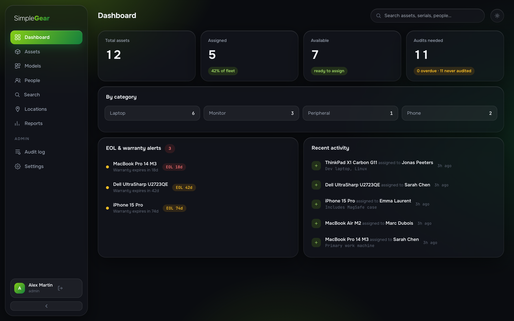
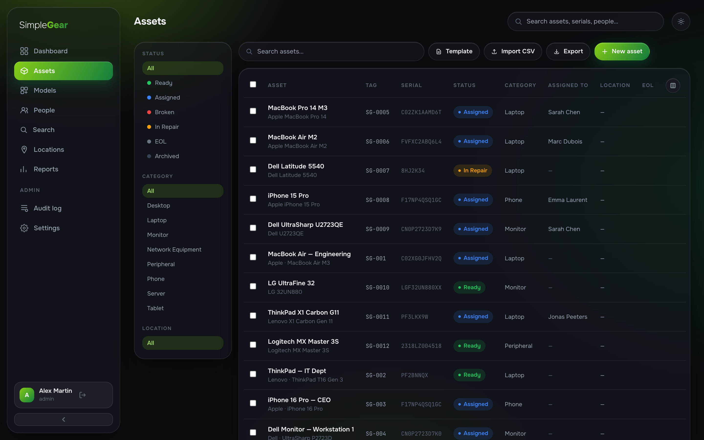
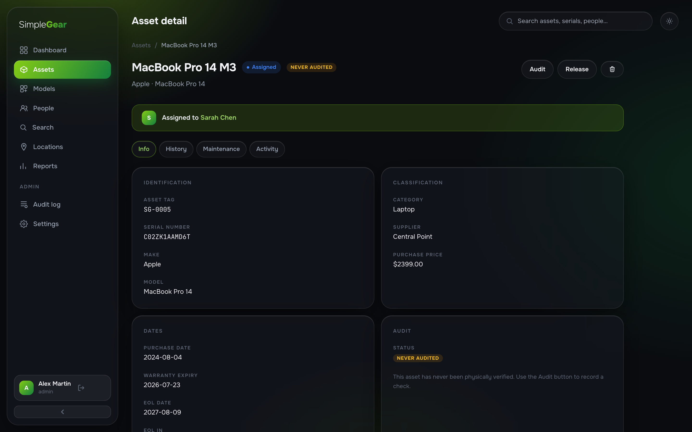
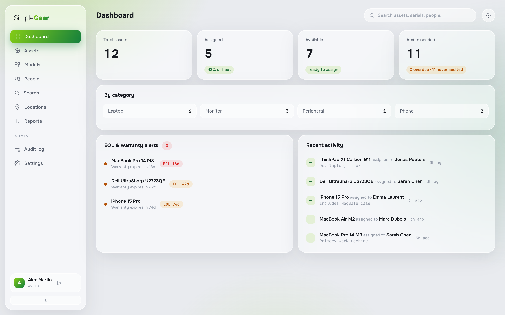
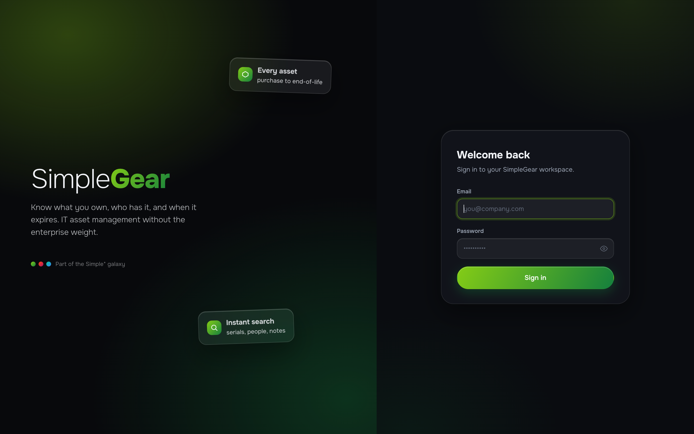

# Simple**Gear**

IT asset management without the enterprise weight. Know what you own, who has it,
and when it expires — for teams of 5–50, deployed with one command.

Part of the **Simple\* galaxy** of self-hosted ops tools, wearing the shared
**Glasshouse** design system: frosted glass panels in a room lit by the app's own
color, with first-class dark and light themes.



## What it does

- **Assets** — full lifecycle from purchase to end-of-life: serials, tags (auto-numbered),
  models, categories, locations, purchase data, warranty and EOL dates
- **Assignments** — who has what, with history and notes; assign and release in two clicks
- **Physical audits** — record sighted checks, schedule the next one automatically,
  track compliance
- **Maintenance** — repairs, upgrades and preventive work with costs and providers
- **Alerts** — warranty and EOL expirations surface on the dashboard before they bite
- **Reports & exports** — audit compliance, lifecycle, maintenance and full register as CSV
- **CSV import** — bring existing inventories in with templated files
- **Audit log** — append-only record of every change, filterable and exportable





## Light theme

Both themes are first-class — toggle from the top bar, the choice persists.





## Quick start

```bash
git clone https://github.com/gillesdelhaes/SimpleGear.git
cd SimpleGear
docker compose up -d
```

Open **http://localhost:4000** — a one-time setup screen creates your admin account
(optionally with sample assets to explore). No config files, no env vars.

## Stack

- **Backend:** Python + FastAPI, PostgreSQL 16, SQLModel + Alembic
- **Frontend:** React 18 + TypeScript, Vite, Tailwind CSS, TanStack Query
- **Design:** Glasshouse — the Simple\* galaxy design system (tokens + components in
  `frontend/src/glasshouse.css`; per-app identity is two CSS variables)
- **Deploy:** 3 containers via Docker Compose (db + api + frontend)

## License

See [LICENSE](LICENSE).
